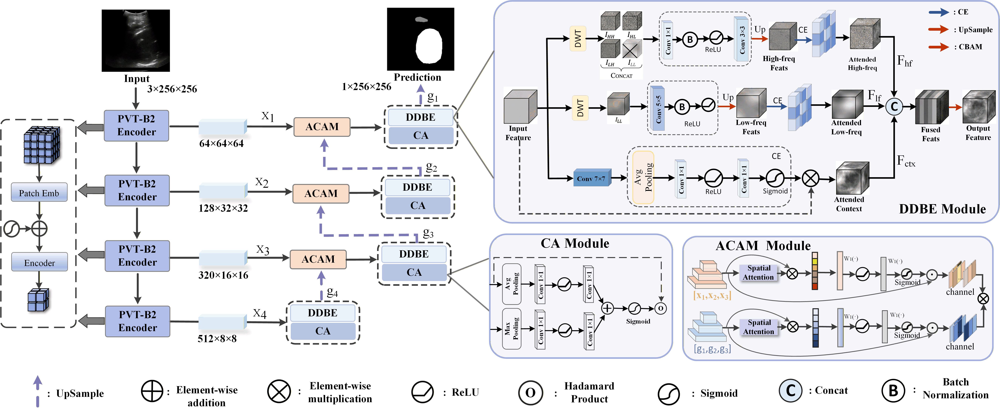

# BDFR-Net

Official implementation package for **BDFR-Net: Boundary-Aware Dual-Domain Feature Reconstruction Network for Fetal Ultrasound Image Segmentation**.

BDFR-Net targets fetal head (FH) and pubic symphysis (PS) segmentation in intrapartum transperineal ultrasound. The model combines a hierarchical PVTv2 encoder with a boundary-aware decoder designed for low-contrast ultrasound anatomy.



## Highlights

- **Dual-Domain Feature Decoupling and Boundary Enhancement (DDBE):** reconstructs boundary-sensitive features by combining high-frequency edge responses, low-frequency structural priors, and spatial context.
- **Adaptive Context Alignment Module (ACAM):** aligns cross-level encoder and decoder features before skip fusion to reduce semantic drift.
- **Boundary-focused fetal ultrasound segmentation:** optimized for FH and PS delineation under speckle noise, acoustic shadowing, and weak tissue boundaries.

## Repository Structure

```text
BDFRNet/
  data/fhps_aop/              # processed FH-PS-AoP data split
  lib/                        # network architecture
  pretrained_pth/pvt/         # PVTv2-B2 ImageNet initialization
  utils/                      # dataset and preprocessing utilities
  weights/best.pth            # trained BDFR-Net checkpoint
  train.py                    # training entry
  evaluate.py                 # evaluation entry
  requirements.txt            # Python dependencies
```

## Installation

Create or activate a Python 3.10 environment, then install the dependencies:

```powershell
pip install -r requirements.txt
```

The code uses PyTorch and automatically selects CUDA when a compatible GPU is available.

## Download

The processed data and trained weights can be downloaded from Baidu Netdisk:

```text
Weights:
https://pan.baidu.com/s/1mnmbRbr5MuwXzzwosop3Ew?pwd=ajgr
Extraction code: ajgr

Processed data:
https://pan.baidu.com/s/1TH7QvBC56pb5mxnJjVoVUw?pwd=tied
Extraction code: tied
```

After downloading, place the files under the following paths:

```text
data/fhps_aop/
weights/best.pth
pretrained_pth/pvt/pvt_v2_b2.pth
```

## Data

The processed FH-PS-AoP split is provided through the download link above. After extraction, the directory should be organized as:

```text
data/fhps_aop/train/images
data/fhps_aop/train/masks
data/fhps_aop/val/images
data/fhps_aop/val/masks
```

Masks use three labels:

```text
0: background
1: pubic symphysis
2: fetal head
```

To rebuild the processed data from MetaImage files:

```powershell
python utils/prepare_fhps_aop.py --source_root <raw_dataset_root> --out_root data/fhps_aop --clean
```

## Training

Run:

```powershell
.\run_train.ps1
```

or:

```powershell
python train.py
```

Default training follows the experimental setting in the paper: PVTv2-B2 encoder, input size `256 x 256`, batch size `16`, AdamW optimizer, learning rate `1e-4`, weight decay `1e-4`, and 100 epochs. The best checkpoint is saved as:

```text
runs/fhps_bdfrnet_b2/best.pth
```

## Evaluation

Run:

```powershell
.\run_eval.ps1
```

or:

```powershell
python evaluate.py
```

## Method Overview

BDFR-Net follows an encoder-decoder design for boundary-ambiguous fetal ultrasound segmentation. The PVTv2 encoder extracts multi-scale features. The decoder reconstructs anatomical structures through cascaded DDBE and ACAM blocks:

- DDBE disentangles frequency-domain detail and structural information with high-frequency, low-frequency, and spatial-context branches.
- ACAM recalibrates skip features through spatial and channel attention before cross-level fusion.
- The final segmentation head predicts background, pubic symphysis, and fetal head classes.

## Citation

```bibtex
@inproceedings{zhang2026bdfrnet,
  title={BDFR-Net: Boundary-Aware Dual-Domain Feature Reconstruction Network for Fetal Ultrasound Image Segmentation},
  author={Zhang, Wenfeng and Liu, Nana and Qin, Qibing and Huang, Xin and Tan, Cong and Hu, Wei and Bai, Jieyun},
  booktitle={International Conference on Medical Image Computing and Computer Assisted Intervention},
  year={2026}
}
```
